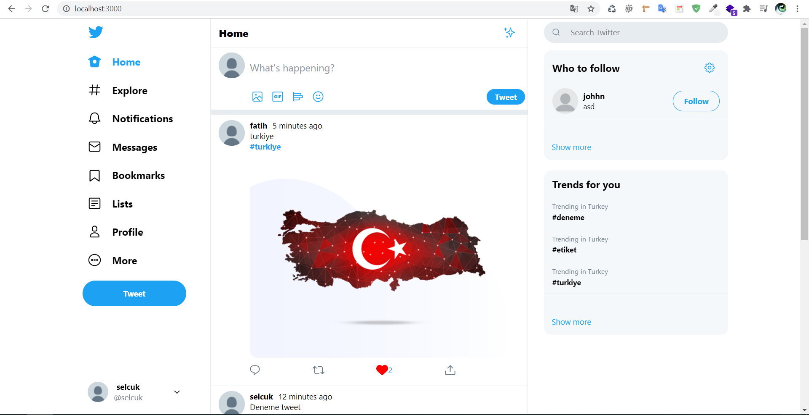
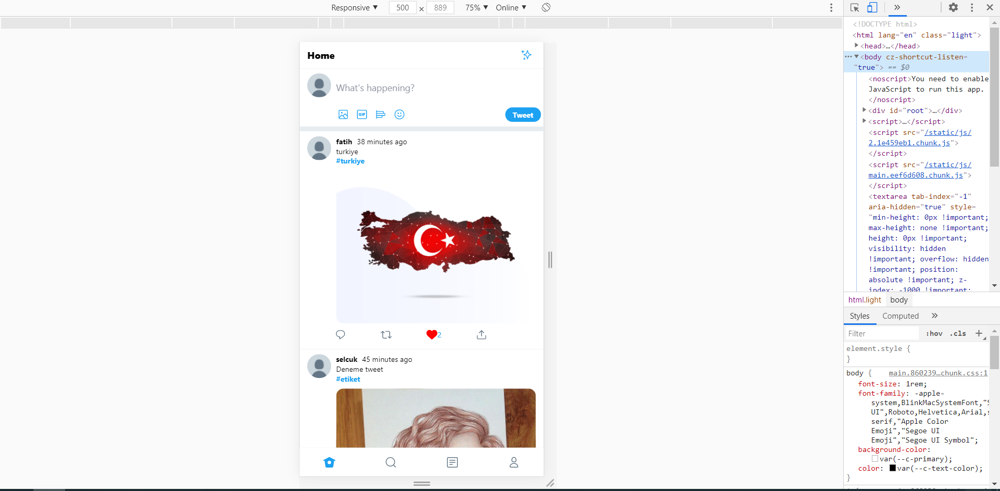
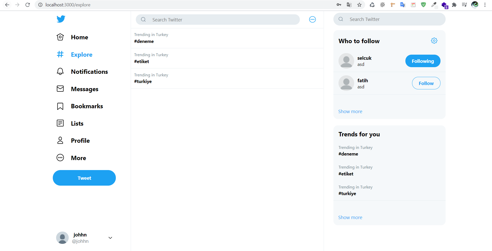
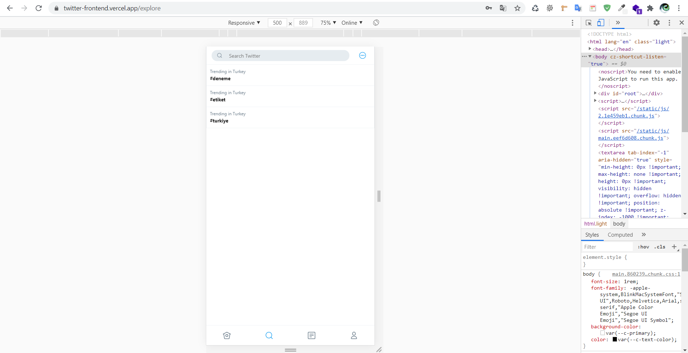
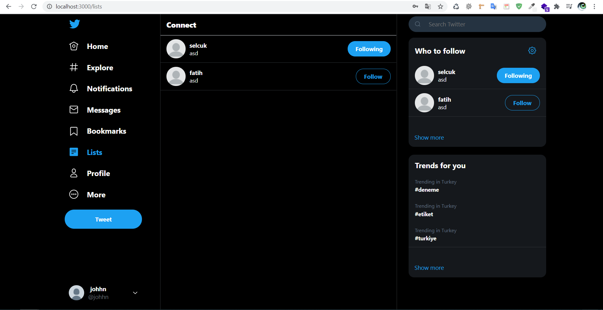
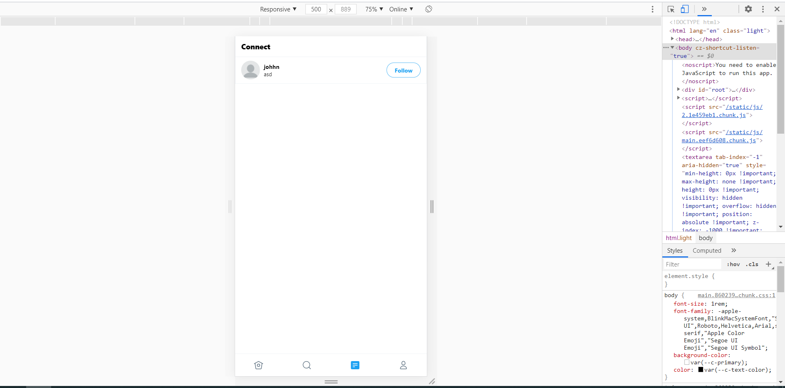
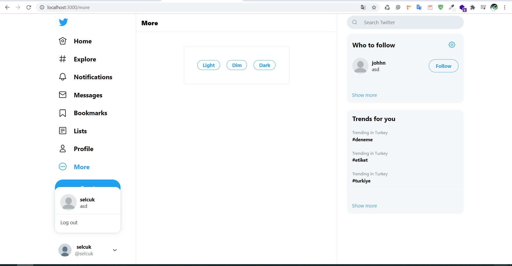
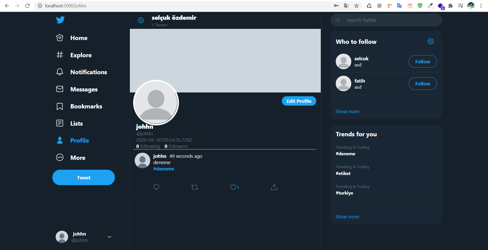
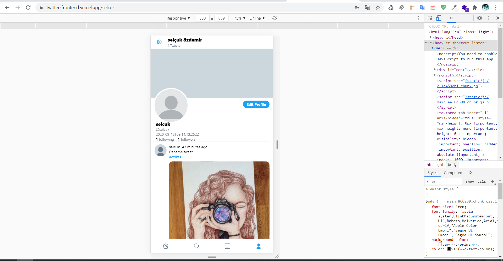

## Twitter Clone Frontend
 - Live: 

Twitter clone UI built using ReactJS.

## :scroll: Todo

- [x] Login/Signup
- [x] New tweet
- [x] Like
- [x] Comment
- [x] View Profile
- [x] Light theme / Dim theme / Dark theme
- [x] Search
- [x] Edit Profile
- [x] Retweet

## :cd: How to run local

At the root of your project create an .env file with the following contents:

```javascript
REACT_APP_BACKEND_URL=<YOUR_BACKEND_URL>
REACT_APP_CLOUDINARY_ENDPOINT=https://api.cloudinary.com/v1_1/<YOUR_CLOUD_NAME>
```

```
- npm install  
- npm run start
```

## UI

### Home





### Explore





### Lists





### More



### Profile




